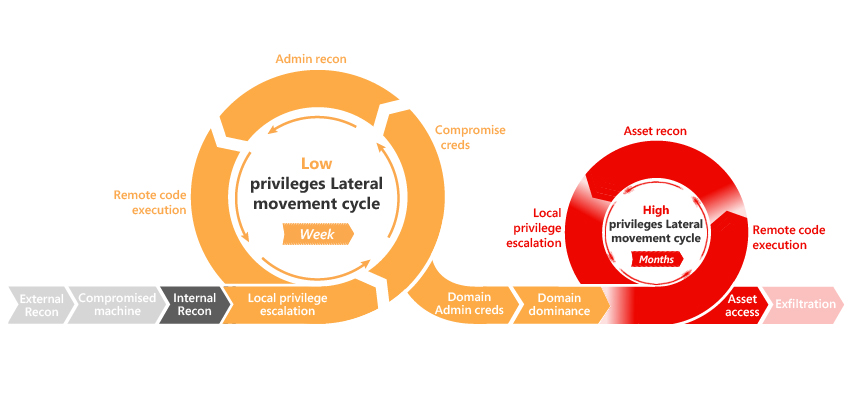

# Active Directory Cheat Sheet

This repository contains a general methodology in the Active Directory environment.
It is offered with a selection of quick commands from the most efficient tools based on Powershell, C, .Net 3.5 and .Net 4.5.

---
#### <U>General Process</U>:
- Recon
- Domain Enum
- Local Privilege Escalation
- Local Account Stealing
- Monitor Potential Incoming Account
- Local Account Stealing
- Admin Recon
- Lateral Movement
- Remote Administration
- Domain Admin Privileges
- Cross Trust Attacks
- Persistance and Exfiltrate

#### <U>Active Directory Kill Chain</U>:

#### <U>Cheat Sheet Tree</U>:
- [/A - Recon](https://github.com/Integration-IT/Active-Directory-Exploitation-Cheat-Sheet/blob/master/A%20-%20Recon/README.md)
- [/B - Domain Enum](https://github.com/Integration-IT/Active-Directory-Exploitation-Cheat-Sheet/blob/master/B%20-%20Domain%20Enum/README.md)
- [/C - Local Privilege Escalation](https://github.com/Integration-IT/Active-Directory-Exploitation-Cheat-Sheet/blob/master/C%20-%20Local%20Privilege%20Escalation/README.md)
- [/D - User Hunting](https://github.com/Integration-IT/Active-Directory-Exploitation-Cheat-Sheet/blob/master/D%20-%20User%20Hunting/README.md)
- [/E - Monitor Potential Incoming Account](https://github.com/Integration-IT/Active-Directory-Exploitation-Cheat-Sheet/blob/master/E%20-%20Monitor%20Potential%20Incomming%20Account/README.md)
- [/F - BloodHound](https://github.com/Integration-IT/Active-Directory-Exploitation-Cheat-Sheet/blob/master/F%20-%20BloodHound/README.md)
- [/G - Lateral Movement](https://github.com/Integration-IT/Active-Directory-Exploitation-Cheat-Sheet/blob/master/G%20-%20Lateral%20Movement/README.md)
- [/H - Persistence](https://github.com/Integration-IT/Active-Directory-Exploitation-Cheat-Sheet/blob/master/H%20-%20Persistence/README.md)
- [/I - Domain Admin Privileges](https://github.com/Integration-IT/Active-Directory-Exploitation-Cheat-Sheet/blob/master/I%20-%20Domain%20Admin%20Privileges/README.md)
- [/J - Cross Trust Attacks](https://github.com/Integration-IT/Active-Directory-Exploitation-Cheat-Sheet/blob/master/J%20-%20Cross%20Trust%20Attacks/README.md)
- [/K - Database Hunting](https://github.com/Integration-IT/Active-Directory-Exploitation-Cheat-Sheet/blob/master/K%20-%20Database%20Hunting/README.md)
- [/L - Security Downgrade](https://github.com/Integration-IT/Active-Directory-Exploitation-Cheat-Sheet/blob/master/L%20-%20Security%20Downgrade/README.md)
- [/M - Privileged Accounts and Groups in Active Directory](https://github.com/Integration-IT/Active-Directory-Exploitation-Cheat-Sheet/blob/master/M%20-%20Privileged%20Accounts%20and%20Groups%20in%20Active%20Directory/README.md)
- [/N - Data Exfiltration](https://github.com/Integration-IT/Active-Directory-Exploitation-Cheat-Sheet/blob/master/N%20-%20Data%20Exfiltration/README.md)
- [/O - Looting](https://github.com/Integration-IT/Active-Directory-Exploitation-Cheat-Sheet/blob/master/O%20-%20Looting/README.md)
- [/P - .NetPayload](https://github.com/Integration-IT/Active-Directory-Exploitation-Cheat-Sheet/blob/master/P%20-%20.Net%20Payload/README.md)
- [/X - Reverse PSShell FUD](https://github.com/Integration-IT/Active-Directory-Exploitation-Cheat-Sheet/blob/master/X%20-%20Reverse%20PSShell%20FUD/README.md)
- [/Y - UL-DL-EXEC Skills](https://github.com/Integration-IT/Active-Directory-Exploitation-Cheat-Sheet/blob/master/Y%20-%20UL-DL-EXEC%20Skills/README.md)
- [/Z - Tool Box](https://github.com/Integration-IT/Active-Directory-Exploitation-Cheat-Sheet/tree/master/Z%20-%20Tool%20Box)

    :construction_worker:
---
#### <U>Contribution, Proposal, Issue</U>:
- [ISSUE TEMPLATE](https://github.com/Integration-IT/Active-Directory-Exploitation-Cheat-Sheet/blob/master/.github/ISSUE_TEMPLATE/feature_request.md)
- MAIL: contact@integration-it.fr