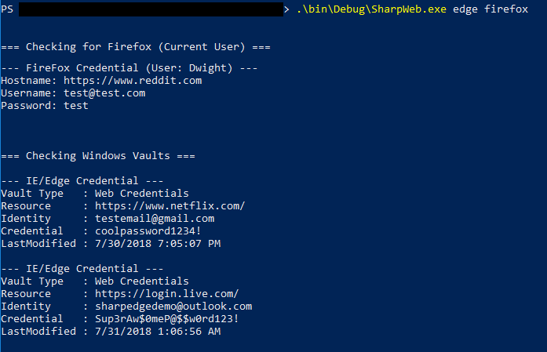

# SharpWeb

## Introduction

SharpWeb is a .NET 2.0 CLR compliant project that can retrieve saved logins from Google Chrome, Firefox, Internet Explorer and Microsoft Edge. In the future, this project will be expanded upon to retrieve Cookies and History items from these browsers.

## Usage

```
Usage:
    .\SharpWeb.exe arg0 [arg1 arg2 ...]

Arguments:
    all       - Retrieve all Chrome, FireFox and IE/Edge credentials.
    full      - The same as 'all'
    chrome    - Fetch saved Chrome logins.
    firefox   - Fetch saved FireFox logins.
    edge      - Fetch saved Internet Explorer/Microsoft Edge logins.
```

## Example: Retrieve Edge and Firefox Credentials

```
.\SharpWeb.exe edge firefox
```


## Example: Retrieve All Saved Browser Credentials

```
.\SharpWeb.exe all
```

## Standing on the Shoulders of Giants

This project uses the work of @plainprogrammer and his work on a compliant .NET 2.0 CLR compliant SQLite parser, which can be found [here](https://github.com/plainprogrammer/csharp-sqlite). In addition, @gourk created a wonderful ASN parser and cryptography helpers for decrypting and parsing the FireFox login files. It uses a revised version of his work (found [here](https://github.com/gourk/FirePwd.Net)) to parse these logins out. Without their work this project would not have come together nearly as quickly as it did.
